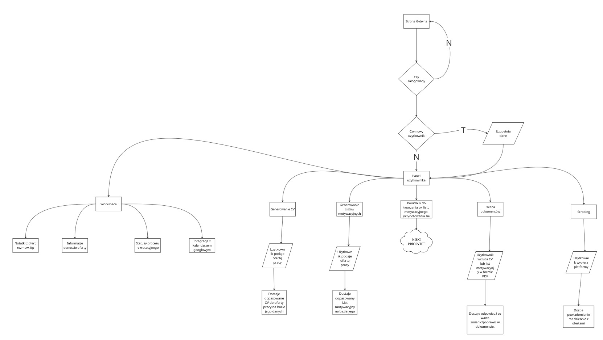
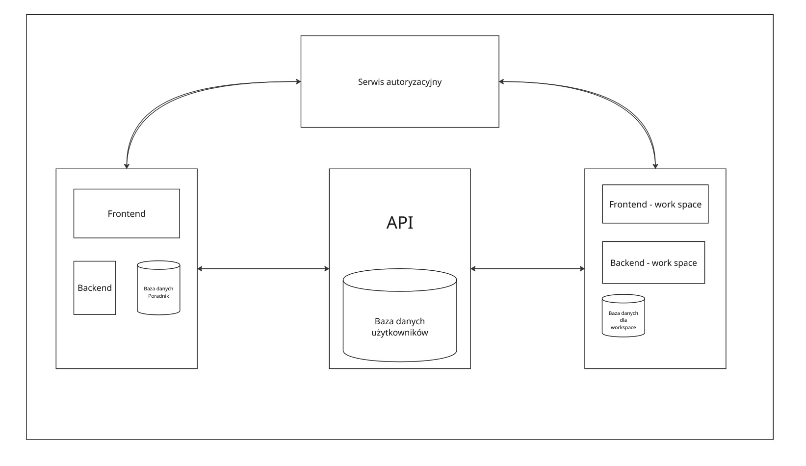

# JobMatch.AI — Inteligentny Generator CV i Listów Motywacyjnych

## Opis projektu
**JobMatch.AI** to aplikacja webowa stworzona dla osób poszukujących pracy.  
Umożliwia tworzenie, dopasowywanie i ocenę dokumentów aplikacyjnych (CV i listów motywacyjnych) z wykorzystaniem sztucznej inteligencji.  

Dzięki integracji z modelami AI (OpenAI API) aplikacja analizuje oferty pracy i automatycznie dopasowuje dane użytkownika (wykształcenie, doświadczenie, kursy itp.), aby stworzyć **spersonalizowane CV** i **list motywacyjny**, maksymalnie zwiększając szanse na zdobycie wymarzonej pracy.  

---

## Główne funkcjonalności

### Generowanie CV dopasowanego do oferty pracy
- Użytkownik wprowadza dane osobiste i zawodowe.  
- Wkleja treść ogłoszenia o pracę.  
- Model AI dopasowuje informacje z profilu do wymagań z oferty i generuje gotowe **CV w PDF**.  

### Generowanie listu motywacyjnego
- Na podstawie profilu użytkownika i oferty pracy generowany jest **list motywacyjny** dopasowany stylistycznie i merytorycznie.  

### Ocena dokumentów
- System AI ocenia jakość CV i listu motywacyjnego (np. spójność, język, dopasowanie do oferty).  
- Użytkownik otrzymuje rekomendacje dotyczące poprawy dokumentów.  

### Powiadomienia o ofertach pracy
- Aplikacja **scrapuje popularne portale z ogłoszeniami** (np. [the-protocol.it](https://the-protocol.it))  
- Wysyła powiadomienia o ofertach dopasowanych do profilu użytkownika.  

### Workspace
- Zapisywanie ulubionych ofert pracy
- Tworzenie notatek dotyczących danej oferty, rozmów rekrutacyjnych
- Ustawienie statusu procesu rekrutacyjnego 
- Integracja z kalendarzem Google 
---

## Stack technologiczny

| Warstwa | Technologia | Opis |
|----------|--------------|------|
| **Frontend** | [Next.js](https://nextjs.org/) + [React](https://react.dev/) | Interfejs użytkownika SPA/SSR |
| **Backend** | [Node.js](https://nodejs.org/) + [Express](https://expressjs.com/) | Główne API, obsługa użytkowników i zapytań |
| **AI Service** | [Python Flask](https://flask.palletsprojects.com/) | Komunikacja z modelami LLM (OpenAI API) |
| **Baza danych** | [PostgreSQL](https://www.postgresql.org.pl/) + [Prisma](https://www.prisma.io/) | Przechowywanie danych użytkowników i profili |
| **Autoryzacja** | [Auth0](https://auth0.com/) | Logowanie, rejestracja i zarządzanie kontami |
| **LLM API** | [OpenAI API](https://platform.openai.com/) | Generowanie i analiza tekstów (CV, list motywacyjny, oceny) |

---

## Flow użytkownika

---

## Flow backendowe

---

## Zespół 5

Daniel Baca, Mateusz Gawlik, Antoni Gawron

