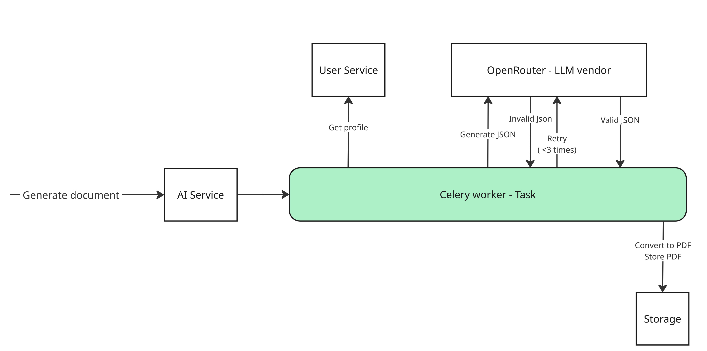
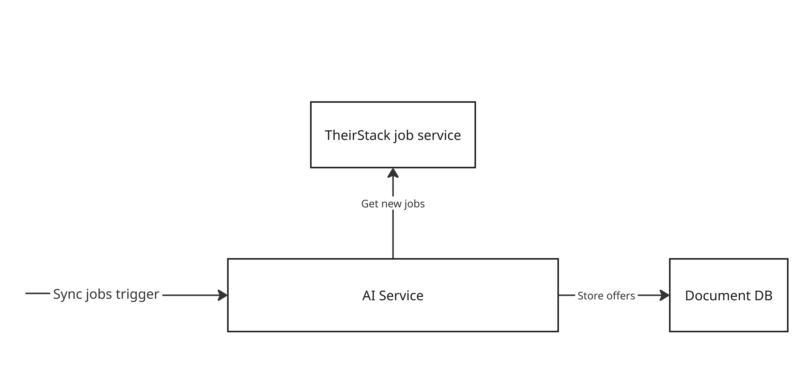

# JobMatch.AI — Inteligentny Generator CV i Listów Motywacyjnych

## Opis projektu
**JobMatch.AI** to aplikacja webowa stworzona dla osób poszukujących pracy.  
Umożliwia tworzenie, dopasowywanie i ocenę dokumentów aplikacyjnych (CV i listów motywacyjnych) z wykorzystaniem sztucznej inteligencji.  

Dzięki integracji z modelami AI (OpenAI API) aplikacja analizuje oferty pracy i automatycznie dopasowuje dane użytkownika (wykształcenie, doświadczenie, kursy itp.), aby stworzyć **spersonalizowane CV** i **list motywacyjny**, maksymalnie zwiększając szanse na zdobycie wymarzonej pracy.  

---

## Główne funkcjonalności

### Generowanie CV dopasowanego do oferty pracy
- Użytkownik wprowadza dane osobiste i zawodowe.  
- Wkleja treść ogłoszenia o pracę.  
- Model AI dopasowuje informacje z profilu do wymagań z oferty i generuje gotowe **CV w PDF**.  

### Generowanie listu motywacyjnego
- Na podstawie profilu użytkownika i oferty pracy generowany jest **list motywacyjny** dopasowany stylistycznie i merytorycznie.  

### Oferty pracy
- Aplikacja zintegrowana jest z zewnętrzyn protalem dostarczającym oferty pracy [TheirStack](https://theirstack.com/en) 
- Użytkownik ma dostęp do ofert pracy i może je pobierać, filtrować, aplikować itd.

## Funkcjonalności, które zostaną dodane

### Ocena dokumentów
- System AI ocenia jakość CV i listu motywacyjnego (np. spójność, język, dopasowanie do oferty).  
- Użytkownik otrzymuje rekomendacje dotyczące poprawy dokumentów.  

### Workspace
- Zapisywanie ulubionych ofert pracy
- Tworzenie notatek dotyczących danej oferty, rozmów rekrutacyjnych
- Ustawienie statusu procesu rekrutacyjnego 
- Integracja z kalendarzem Google 
---

## Stack technologiczny

| Warstwa | Technologia | Opis |
|----------|--------------|------|
| **Frontend** | [Next.js](https://nextjs.org/) + [React](https://react.dev/) | Interfejs użytkownika SPA/SSR |
| **Backend** | [Node.js](https://nodejs.org/) + [Nest.js](https://nestjs.com/) | Główne API, obsługa użytkowników i zapytań |
| **AI Service** | [Python Fast API](https://fastapi.tiangolo.com/) | Komunikacja z modelami LLM (OpenRouter) |
| **Baza danych** | [PostgreSQL](https://www.postgresql.org.pl/) + [Prisma](https://www.prisma.io/) | Przechowywanie danych użytkowników i profili |
| **Autoryzacja** | [Auth0](https://auth0.com/) | Logowanie, rejestracja i zarządzanie kontami |
| **LLM API** | [OpenRouter](https://openrouter.ai/) | Generowanie i analiza tekstów (CV, list motywacyjny, oceny) |

---

## Flow użytkownika

---

## Architektura systemu

---

## Architektura Mikroserwisowa

### AI Service
[Dokumentacja AI Service](ai-service/README.md)

**Odpowiedzialny za:**
- Generowanie spersonalizowanych dokumentów (CV i listów motywacyjnych) na podstawie profilu użytkownika i ofert pracy
- Integracja z modelami LLM (OpenRouter)
- Synchronizacja i zarządzanie ofertami pracy z zewnętrznych portali (TheirStack)

**Technologia:** Python + FastAPI

---

### User Service
[Dokumentacja User Service](user-service/README.md)

**Odpowiedzialny za:**
- Przechowywanie i zarządzanie danymi użytkowników (edukacja, doświadczenie, umiejętności, certyfikaty)
- Zarządzanie profilami użytkowników
- Obsługa operacji CRUD na danych użytkownika
- Komunikacja z bazą danych (PostgreSQL + Prisma ORM)

**Technologia:** Node.js + NestJS + PostgreSQL

---

### Gateway
**Odpowiedzialny za:**
- Kierowanie żądań HTTP na odpowiednie mikroserwisy (routing)
- Load balancing i obsługa ruchu przychodzącego
- Walidacja tokenów autoryzacyjnych

**Technologia:** Node.js + Express

---

### Frontend
**Odpowiedzialny za:**
- Interfejs użytkownika webowej aplikacji
- Logika prezentacji i interakcja z użytkownikiem
- Komunikacja z API poprzez Gateway
- Wyświetlanie generowanych dokumentów (CV, listy motywacyjne)
- Przeglądanie i filtrowanie ofert pracy

**Technologia:** Next.js + React + TypeScript

---

## Generowanie Dokumentów

## Integracja ofert pracy

## Zespół 5

Daniel Baca, Mateusz Gawlik, Antoni Gawron

